# ⚡ Distributed Load Engine

A scalable, distributed load-testing and chaos engineering platform built to benchmark API performance, monitor real-time telemetry, and test application resilience under extreme network conditions.


## 🚀 Key Features

* **Distributed Execution Plane:** Utilizes Redis and BullMQ to distribute high-throughput load-testing jobs across a horizontally scaled cluster of Dockerized worker nodes.
* **High-Volume Telemetry Ingestion:** Workers batch and stream sub-millisecond latency metrics to InfluxDB, preventing traditional relational database bottlenecks during extreme load.
* **Real-Time WebSocket Dashboard:** A Next.js frontend connects to the control plane via Socket.io to broadcast live P95 latency, average response times, and Requests Per Second (RPS) as the test runs.
* **Chaos Engineering Engine:** Built-in middleware allows engineers to simulate hostile network conditions by dynamically injecting artificial latency and programmable packet drop rates (Chaos Mode).
* **High-Performance HTTP Client:** Worker nodes leverage `undici` to maximize connection pooling and achieve thousands of concurrent requests from a single container.

## 🏗️ System Architecture

```mermaid
architecture-beta
    group control_plane(server)[Control Plane]
    group execution_plane(cloud)[Execution Plane]
    group data_layer(database)[Data Layer]
    group target_env(internet)[Target Environment]

    service client(laptop)[NextJS Dashboard]
    service api_gateway(server)[Express API] in control_plane

    service postgres(database)[PostgreSQL] in data_layer
    service redis(database)[Redis Queue] in data_layer
    service tsdb(database)[InfluxDB] in data_layer

    service worker1(server)[Worker Node 1] in execution_plane
    service worker2(server)[Worker Node 2] in execution_plane
    service worker_n(server)[Worker Node N] in execution_plane

    service target(server)[Target API] in target_env

    client:R --> L:api_gateway
    api_gateway:B --> T:postgres
    api_gateway:B --> T:redis
    redis:B --> T:worker1
    redis:B --> T:worker2
    redis:B --> T:worker_n
    worker1:R --> L:target
    worker2:R --> L:target
    worker_n:R --> L:target
    worker1:L --> R:tsdb
    worker2:L --> R:tsdb
    worker_n:L --> R:tsdb
    tsdb:T --> B:api_gateway
```


## Technology Stack
* **Control Plane API**: Node.js, Express.js, Socket.io, Prisma ORM
* **Execution Workers**: Node.js, BullMQ, Undici, Docker
* **State & Message Broker**: PostgreSQL, Redis
* **Time-Series Database**: InfluxDB
* **Frontend UI**: Next.js (App Router), Tailwind CSS, Recharts, Lucide React

## Local Development Setup
This project is structured as a monorepo containing the API, the frontend, and the execution workers.
### Prerequisites:
* Docker Desktop
* Node.js (v18+)
* NPM Workspace Support

### 1. Start the Infrastructure Cluster
Boot up the PostgreSQL database, Redis message broker, InfluxDB telemetry store, and a cluster of 3 worker nodes.
Bash
```
docker-compose up -d --build
```

### 2. Initialize the Database
Push the Prisma schema to the newly created PostgreSQL container.
Bash
```
cd packages/database
npx prisma db push
npx prisma generate
```

### 3. Seed Initial Data
Open Prisma Studio to create a User, a Project, and your first Test Scenario.
Bash
```
npx prisma studio
# Opens at http://localhost:5555
```
### 4. Start the Control Plane API
Start the Express server that orchestrates the jobs and streams WebSocket data.
Bash
```
cd apps/control-plane-api
npm run dev
# Runs on http://localhost:3000
```
### 5. Start the Live Dashboard
In a new terminal window, boot the Next.js UI. (Ensure the API is running first so Next.js automatically maps to port 3001).
Bash
```
cd apps/frontend
npm run dev
# Opens at http://localhost:3001
```

## Activating Chaos Mode
To test your application's resilience under poor network conditions, update a test scenario via Prisma Studio with the following variables:
* **addedLatency**: Inserts artificial delay in milliseconds (e.g., 300).
* **errorRate**: Randomly drops a percentage of packets (e.g., 0.2 for 20%).
Watch the P95 latency graph instantly reflect the injected chaos in real-time.
